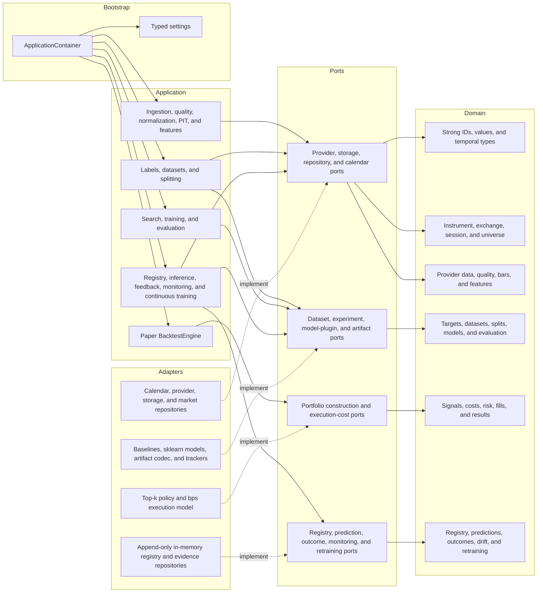

# Component Boundaries

```mermaid
flowchart LR
  subgraph Domain
    Common[Strong IDs, values, and temporal types]
    Market[Instrument, exchange, session, and universe]
    Data[Provider data, quality, bars, and features]
    Modeling[Targets, datasets, splits, models, and evaluation]
    Backtest[Signals, costs, risk, fills, and results]
    MLOps[Registry, predictions, outcomes, drift, and retraining]
  end

  subgraph Ports
    DataPorts[Provider, storage, repository, and calendar ports]
    ModelPorts[Dataset, experiment, model-plugin, and artifact ports]
    BacktestPorts[Portfolio construction and execution-cost ports]
    MLOpsPorts[Registry, prediction, outcome, monitoring, and retraining ports]
  end

  subgraph Application
    DataApps[Ingestion, quality, normalization, PIT, and features]
    DatasetApps[Labels, datasets, and splitting]
    ModelApps[Search, training, and evaluation]
    BacktestApp[Paper BacktestEngine]
    MLOpsApps[Registry, inference, feedback, monitoring, and continuous training]
  end

  subgraph Adapters
    MarketAdapters[Calendar, provider, storage, and market repositories]
    ModelAdapters[Baselines, sklearn models, artifact codec, and trackers]
    PolicyAdapters[Top-k policy and bps execution model]
    MLOpsAdapters[Append-only in-memory registry and evidence repositories]
  end

  subgraph Bootstrap
    Settings[Typed settings]
    Container[ApplicationContainer]
  end

  DataApps --> DataPorts
  DatasetApps --> DataPorts
  DatasetApps --> ModelPorts
  ModelApps --> ModelPorts
  BacktestApp --> BacktestPorts
  MLOpsApps --> MLOpsPorts
  MLOpsApps --> ModelPorts
  MLOpsApps --> DataPorts

  DataPorts --> Common
  DataPorts --> Market
  DataPorts --> Data
  ModelPorts --> Modeling
  BacktestPorts --> Backtest
  MLOpsPorts --> MLOps

  MarketAdapters -. implement .-> DataPorts
  ModelAdapters -. implement .-> ModelPorts
  PolicyAdapters -. implement .-> BacktestPorts
  MLOpsAdapters -. implement .-> MLOpsPorts

  Container --> Settings
  Container --> DataApps
  Container --> DatasetApps
  Container --> ModelApps
  Container --> BacktestApp
  Container --> MLOpsApps
```
