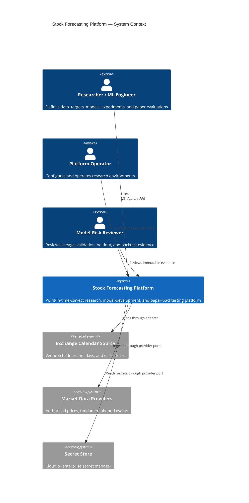

# C4 — System Context

```mermaid
C4Context
  title Stock Forecasting Platform — System Context

  Person(researcher, "Researcher / ML Engineer", "Defines data, targets, models, experiments, and paper evaluations")
  Person(operator, "Platform Operator", "Configures and operates research environments")
  Person(reviewer, "Model-Risk Reviewer", "Reviews lineage, validation, holdout, and backtest evidence")
  System(platform, "Stock Forecasting Platform", "Point-in-time-correct research, model-development, and paper-backtesting platform")
  System_Ext(calendarSource, "Exchange Calendar Source", "Venue schedules, holidays, and early closes")
  System_Ext(marketData, "Market Data Providers", "Authorized prices, fundamentals, and events")
  System_Ext(secretStore, "Secret Store", "Cloud or enterprise secret manager")

  Rel(researcher, platform, "Uses", "CLI / future API")
  Rel(operator, platform, "Configures and observes")
  Rel(reviewer, platform, "Reviews immutable evidence")
  Rel(platform, calendarSource, "Reads through adapter")
  Rel(platform, marketData, "Ingests through provider ports")
  Rel(platform, secretStore, "Reads secrets through provider port")
```

A broker or order-management system is intentionally absent from this context. Section 15 is
paper-only.
